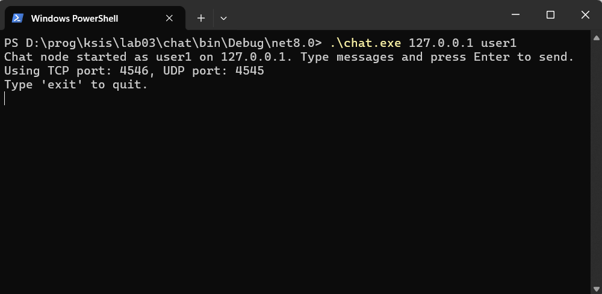
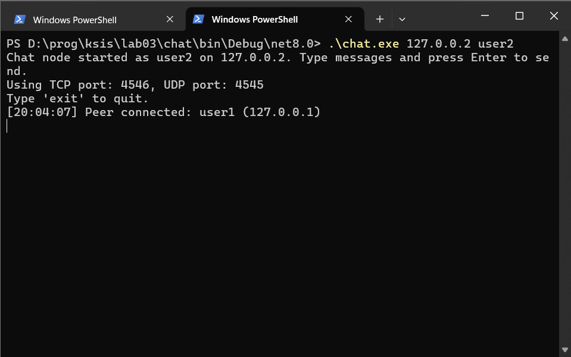
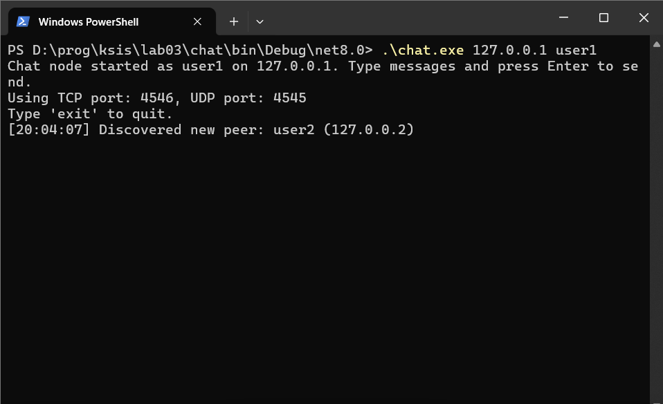

# Скриншоты работы программы

Система: Windows

Команда для запуска:
.\chat.exe \<USER_IP> \<USERNAME>

Запустим программу для первого пользователя:

Запустим программу для второго пользователя:

Сразу можем наблюдать, что программа обнаружила первого пользователя.

Посмотрим, что в этот момент увидел первый пользователь:

Видим, что программа обнаружила второго пользователя.

Теперь пользователи могут обмениваться сообщениями:

Далее можем подключить третьего и четвертого пользователя и проверить работу программы:

Закрыть программу можно командой exit и все пользователи будут видеть отключение пользователя:

